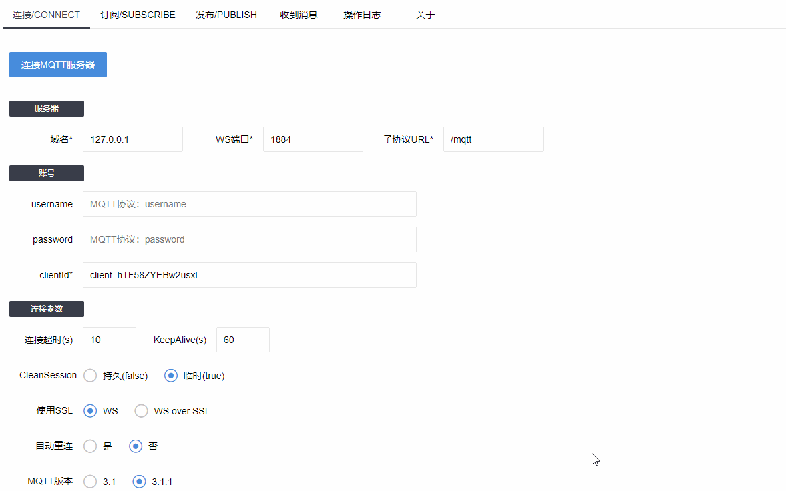

# FastMqtt

FastMqtt是一款开源的MQTT Web客户端，用于快速测试MQTT功能，双击浏览器打开，无需任何依赖，可以集成到Java等项目中去。

# 操作截图

# 相关信息
基于：

 
支持：

# 关注作者
* 博客：<a href="http://www.bewindoweb.com/" style="color:#478cdc">三颗豆子分裂中</a>
* QQ群：MQTT吹水群 / 701676670
* github：<a href="https://github.com/BEWINDOWEB" style="color:#478cdc">BEWINDOWEB</a>
